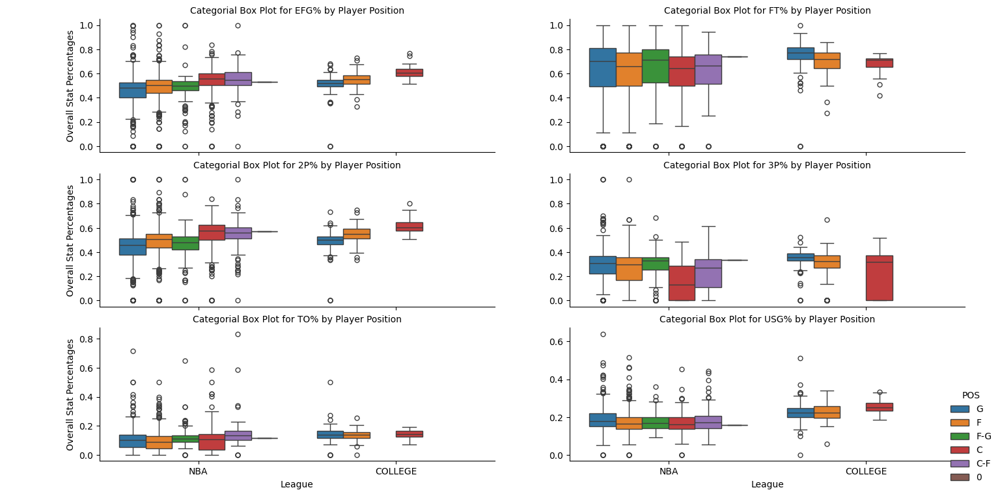

# CS-4641-Midterm-Checkpoint Report

## Introduction/Background
The anticipated yearly NBA draft is crucial for teams seeking new professional talent [4]. Organizations want championship teams, but franchise players are expensive & scarce. We seek a new approach for rookie player selection based on professional player similarity. Similar analysis has been done, but limited to professional players [1], whereas we will include collegiate players. We will explore this through unsupervised & semi-supervised methods. The 1st data source contains NBA player performance statistics across multiple seasons ([Source](https://www.nbastuffer.com/nba-stats/player/)). The 2nd data source contains an index of college player stats ([Source](https://www.sports-reference.com/cbb/players/)). The last data source contains collegiate stats for drafted players ([Source](https://www.basketball-reference.com/draft/)). 

## Problem Definition
Draft decisions have major financial and strategic reprecussions for NBA franchises. A good draft pick can completely change the season trajectory for a team, potentially resulting in increased viewership and greater revenue opportunities through ticket sales, sponsorships, and merchandise. Traditional scouting methods and draft predictions typically rely on subjective assessments that may not fully capture a player’s long term potential or compatability with a given team. While existing approaches work to cluster NBA players together, there is limited work attempting to bridge the gap between the collegiate level and professional level using data-driven methods. This lack of structured methods for talent identification limits a franchise’s ability to make informed and objective decisions during the NBA Draft. The objective of our project is to enable organizations to identify draft prospects who most closely resemble the statistical profiles of desirable NBA players so they can make the best possible decisions in the NBA Draft.

## Methods
Data pre-processing proved to be intensive for our project. The first data source contained performance statistics for college athletes, and a webscraper was needed to retrieve this data. Our list for which athletes we wanted to webscrape came from our third data source, in which we were able to compile the names of Drafted athletes over the past decade. Not every drafted athlete was coming from college however, in fact, nearly half of these recruits did not go college. They were either overseas players (ex. Zaccharie Risacher), or G-League players (ex. Scoot Henderson). So out of the ~600 records of drafted players over the past decade, we only ended up having performance statistics for ~ 330 of them. The collegiate athletes had a much wider range of stats reported, but for our purposes, we only needed the data that overlapped with that of the NBA players. Fortunately, this data contained career performance statistics, so we didn't have to aggregate player data across various seasons, which would have been far more tedious. 

The second data source was NBA player statistics, covering both regular season and playoff performance for every season from 2017–2018 through 2024–2025. Because the set of features differed before and after the 2022 season, we adjusted the data to ensure consistency across all records. Specifically, we aligned the pre-2022 data with the post-2022 feature set by dropping columns that were no longer present (e.g., MIN%, TRB%, AST%) and deriving new features where needed (for example, creating P+R as the sum of points per game and rebounds per game). After ensuring all data shared the same features, we combined the pre-2022 and post-2022 records into a single, unified NBA dataset.

Our goal with pre-processing was to get a single data set that contained aggregated player statistics for both NBA and draft-eligible players, with one data point for every player. The numerical data was aggregated for each player by taking the average of each feature. The only non-numerical feature (besides player name) was player position. Player position in the original data set took the form of F (forward), C (center), or G (guard). Some players had joint positions (like F-C, or F-G). In order to reflect the joint positions, we encoded positions by creating three features (F, C, G) and assigning a 1 if the player held that position and a 0 if they did not. For instance, if a player held the position F-C in the original data, their position entry in the cleaned data looks like this:

| F | C | G |
| --| - | - |
| 1 | 1 | 0 |

Since we retrieved data from multiple seasons, there were instances of a player holding multiple positions across different seasons. We decided to treat this scenario as two different datapoints in order to consider how a player's position affects their performance statistics. For instance, if Player A holds the position F for two seasons, then holds the position C for two seasons, there will be two records for that player with the aggregated statistics for each respective position.

### Data Imputation
We decided to handle missing values within our college & nba datasets separately, as we wanted to preserve the skill level difference between college athletes & professional NBA players. This acted as a "control" for ensuring the imputed values weren't inflated or deflated as a result of the imputation mixing the skill levels between NBA & College players.
To perform K-nearest neighbors for data imputation, we needed to determine k, the number of nearest neighbors to average over [3]. Our approach included: 
> 1.) Separating our complete & incomplete records <br>
2.) Randomly masking 10% of our complete record entries to NaN's <br>
3.) Standardizing our data & running a KNN imputation over it <br>
4.) Measuring the difference between the imputed value & the true value using root mean squared error <br>
5.) Comparing this RMSE for k in the range of 1-20 <br>

The image below summarizes this analysis for handling missing values for collegiate athletes. This process was repeated for NBA players, allowing us to impute our data more effectively rather than just drop records or using overall column means. 

### Finding Optimal K


## EDA
Once our datasets were cleaned separately, we merged them & performed Exploratory Data Analysis. Categorical boxplots, heatmaps, & dimensionality reduction using PCA were generated to better understand how our data was shaped, correlated, & significant [2]. The below plots summarize our findings from EDA. 

### Correlation Plot 


1. Guards have a moderate negative correlation with Blocks & Rebounds Per Game, Centers have a moderate negative correlation with 3p%, & Forwards have a moderate negative correlation with Assists per Game. These correlations seem pretty intuitive, as different positions have different roles in regards to offensive & defensive responsibilities. 
2. 2 Point Attempts is strongly correlated with Free Throw Attempts. This is pretty understandable, as more shot attempts increases the expected # of foul calls & thus Free Throw Attempts.
3. Effective Field Goal % & True Shooting % are strongly positively correlated. This makes sense because effective field goal % only assesses field goals, whereas True Shooting % asseses both field goals and free throws. TS% is more encapsulating than eFG%.
4. The strong correlations between P, R, & A are just sums of the PpG, RpG, & ApG, so it holds that there would be strong correlation amongst these combined features & their individual ones

### Categorical Box Plots 





Across the board, NBA performance stats possess more variance per player position than that of college performance, but this is most likely due to the disparity in the proportion of NBA data we have in comparison to college data. 
The variance for collegiate performance may be similar, but we would need more data to discern this. Fortunately for our analysis, this discrepancy shouldn't impact our goals for the project as we are clustering, but is something for us to highlight.

### PCA 

 <br>
It takes about 10 principal components to capture 90% of the variance of our data in z-space. The first principal component captures close to half of the total variance within our combined NBA & Collegiate data, but the successive principal components don't capture nearly as much variance. PCA doesn't prove to be as useful for our analysis unfortunately, as we would have hoped for the first 2 or 3 principal components to have captured over 90% of the data. 


This plot informs us of the most influential features for each principal component. We can leverage this & experiment with different combinations of the most influential features across the principal components to reduce our features substantially. 


The data seems to become central as we plot against Principal Components 4 & 5. The shape of the principal components themselves appear to be somewhat gaussian with some skew. 
The plot of PCA1 vs PCA2 appears to be somewhat logarithmic, which highlights that our data is nonlinear. The relationship between features in the x-space within these principal components may be logarithmically related to each other. 

### Featuring Exclusion through Pearson Correlation calculations.
The aim of this step is to find any pairs of data that might be highly correlated and therefore can be dropped for saving computational power and time. Specifically, Pearson corrrelation coefficient was used for quantifying the strength and direction of a linear relationship between two variables. In addition, its unitless nature also allows for comparison across different datasets. data.corr(method="pearson") was implemented for correlation determination between any feature pairs in the data and it resulted in a correlation matrix with each element being the correlation between the ith and jth feature of the data. Following this, in order to identify the high correlation feature pairs, each element in the matrix was looped through to check for its value, if the correlation value is higher than 0.9, then it was considered to be of high correlation and therefore was appended to a list of feature pairs with high correlation. After carefully evaluating each feature pairs, "MPG", "FTA", and "TS" were kept while all the other features were dropped. 

| Feature 1  | Feature 2 | Correlation |
| ---------- | --------- | ----------- |
|  MpG        | PpG  | 0.907016 |
|  MpG        | P+R  | 0.915429 |
|  MpG        | P+A  | 0.910015 |
|     MpG     | P+R+A |    0.922972
|       FTA   |  2PA  |   0.940017
|      eFG%   |  TS%  |   0.966512
|       PpG   |  P+R  |   0.978628
|       PpG   |  P+A  |   0.990710
|       PpG   | P+R+A |    0.980978
|       P+R   |  P+A  |   0.965289
|      P+R    | P+R+A |    0.993298
|      P+A    | P+R+A |    0.982920

### Data Standardization
Before fitting the data to the actual model, it is important to standardize the values across the column to have zero mean and unit variance so that no single feature dominates purely because of its scale. This is especially important for the model that our team chooses to implement as the algorithm of this model is dependent on distance calculation and this standardization step avoids introducing bias solely due to the fact that ts numeric range is larger. The implementation used z-score, which for each feature, each element was scaled with this calculation: (element x - feature's sample mean)/(feature's standard deviation). By centering every feature at zero and giving it unit variance, this ensures every dimension contributes equally to the distance metrics.

## Model 1: Hierarchical Clustering
### Data Fitting
Hierarchical clustering was chosen as our first model to implement because it doesn’t require us to pre-specify the number of clusters and it reveals the full nested relationships among all the data points based on their feature similarity. It was implemented with the following line:
```js
Z = sch.linkage(df_num_scaled, method="ward", metric="euclidean")
```
which results in a linkage matrix Z using Ward’s minimum-variance with Euclidean distances on the pre-processed data. Then after the linkage matrix is formed, a dentrogram is drawn based on the matrix to show the overall merging structure and the distance at which each pair or group of players merge. 

The result is a full hierarchical tree with the x-axis listing each player's name and the y-axis giving the linkage distances. From the dendrogram you can visually inspect which players are most similar at the leaf nodes and where larger clusters form. The visualization shown above is just a zoomed in version of the entire dentrogram. The complete dentrogram can be found under this folder with the name: dentrogram_for_model_1.png.

### Player Selection (1-10 Ranking of possible candidates)
In order to find the top 10 most compatible players from the dataset with a given the desired player stats, there are two methods implementd to achieve this result. The purpose of the first one is to keep track of the name of the players in a cluster whenever a new one is formed while the second is the actual ranking algorithm that decided the top 10 players given a target player. 
#### First method: build_cluster_members.
This method takes in the linkage matrix Z and the originial number of players N. It iterates through each merge in Z to assign each newly formed cluster a ID and builds a dictionary that maps every cluster to the list of original player indices it contains. The result is the total number of clusters in the entire dentrogram with 0 to N-1 being the leaf clusters mapped to each orignial players while the rest being the newly merged clusters.
#### Second method: trace_path.
In order to find the top 10 most compatible players, the algorithm starts at the target player, then going up the dentrogram to find the most compatible player at each level until the 10th one is found. At each merging step between the current cluster and the other cluster, the algorithm examines the other cluster to determine whether it is just one single player or a group of other players (another cluster). If it is the former, then it appends that player to the list. If not, then it computes the Euclidean distances between the target player's stats and that of every member in that cluster to select the closest player.

The Outputs below are an example used to examine the implementation of each method.
First Method:
```
# Test build_cluster_members
for cid in (N, N+1, N+2):
    members = cluster_members.get(cid, [])
    print(f"Cluster {cid} → original indices: {members}")
    print(f"Cluster {cid} → player names: {', '.join(player_names[i] for i in members)}")
```
Output:
```
Cluster 1877 → original indices: [1424, 1447]
Cluster 1877 → player names: Trey McKinney-Jones NBA, Tyler Hall NBA
Cluster 1878 → original indices: [978, 1227]
Cluster 1878 → player names: Malachi Flynn NBA, Raul Neto NBA
Cluster 1879 → original indices: [795, 1133]
Cluster 1879 → player names: Josh McRoberts NBA, Nicolas Brussino NBA
```
Second Method:
```
##################### INPUT YOUR DESIRED PLAYER STATs HERE #################
target_idx = player_names.index("LeBron James NBA")
top10 = trace_path(Z, df_num_scaled, target_idx, player_names, 10)
for rank, player in enumerate(top10, 1):
    print(f"{rank}. {player}")
```
Output:
```
1. Luka Doncic NBA
2. Luka Doncic NBA
3. Trae Young NBA
4. James Harden NBA
5. Markelle Fultz College
6. Kevin Durant NBA
7. Gary Trent  College
8. LaMelo Ball NBA
9. Cameron Payne College
10. Ben Simmons College
```

## Results and Discussion


### Quantitative Metrics

For each significant flat cut in our dendogram, we calculated both the Davies-Bouldin Index and the Silhouette Score. These are two classic clustering evaluation metrics that are used in unsupervised clustering to evaluate the quality of the clusters themselves, regardless of any ground truth. 

Additionally, we designed the following custom metrics. 

#### Paired Point Ratio 
In our processed dataset, we have 360 players that each have a NBA datapoint and a collegiate datapoint. We would expect that, in a good clustering algorithm for predicting best draft picks for a specific NBA player, that for each player's NBA career datapoint and collegiate datapoint would be clustered together. This defines our first custom metric, PPR. 

$$\text{PPR} = \frac{\text{No. of NBA-college pairings clustered together}}{\text{No. of players with NBA and college careers}}$$

#### PPR Harmonic Mean 

More NBA-college pairs will be captured in the same cluster as $k$ decreases. This phenomena is deceptive, as it is not necessarily a meaningful result that $\text{PPR}=1$ when there is only one cluster. Thus, we also decided to take the harmonic mean of PPR with the normalized Davies-Bouldin Index at each cut. 

$$\text{DB}_{\text{norm}} = \frac{1}{1 + \text{DB}}$$

$$\text{PPR Harmonic Mean} = 2 \cdot \frac{\text{PPR} \cdot DB_{\text{norm}}}{\text{PPR} + \text{DB}_{\text{norm}}}$$

PPR Harmonic Mean takes on values from 0 to 1, with a value of 1 indicating both good pairing performance and high clustering quality. If either PPR is low, indicating poor pairing performance, or if the Davies-Bouldin Index is high, indicating poor clustering quality, the PPR Harmonic Mean will take on a lower value. 

#### Fowlkes-Mallow Score 

Inspired again by an expectation of a pairing phenomena, we were able to come up with a method to generate pseudo ground truths for our clustering. Assuming that players who had similar NBA careers derived from similar collegiate careers, we generated ground truths for NBA career datapoint pairs depending on the cluster assignments of corresponding collegiate career pairs. If players A and B had their collegiate careers clustered together, then we expect their NBA careers to be clustered together. Similarly, is players A and B had collegiate careers clustered separately, then we expect their NBA careers to mirror that behavior. Using this process, we were able to derive the metrics necessary to arrive at a Fowlkes-Mallow Score for each flat cut. 

We calculated evaluation metrics and visualizations for each significant flat cut in the dendogram, shown below. 

|Number of Clusters|Cut Height        |Total Pairings at Cut|Davies-Bouldin    |Silhouette Score  |PPR               |PPR Harmonic Mean |Fowlkes-Mallows   |
|------------------|------------------|---------------------|------------------|------------------|------------------|------------------|------------------|
|46                |14.181428577682748|11                   |1.677512019731425 |0.0950022358669317|0.0305555555555555|0.0564895398825785|0.1382753038578198|
|45                |14.264975532002838|12                   |1.6940395106123325|0.0946038573566716|0.0333333333333333|0.061173230042461 |0.1388226764862107|
|44                |14.348427054754673|12                   |1.6924936337632202|0.0934270411006422|0.0333333333333333|0.0611761226416359|0.1553753956600246|
|43                |14.67400564348675 |17                   |1.66411888893133  |0.0927066077903114|0.0472222222222222|0.0838905431392753|0.1535465560797656|
|42                |14.736340545301118|17                   |1.6995251090866794|0.0921770403493579|0.0472222222222222|0.0837661400744986|0.1536945791856946|
|41                |15.31209154343401 |17                   |1.7065920606861693|0.0913318165725241|0.0472222222222222|0.0837413538372273|0.1537601057688698|
|40                |15.660210094414817|17                   |1.7112504809525149|0.090192860449573 |0.0472222222222222|0.0837250231701571|0.1556647240516436|
|39                |15.949433977684272|17                   |1.7490392517077875|0.0895544085543175|0.0472222222222222|0.083592784997252 |0.1556647240516436|
|38                |16.045566581033068|17                   |1.753076261222783 |0.0967218731407471|0.0472222222222222|0.0835786825626952|0.1564705457138204|
|37                |16.04732201267696 |17                   |1.7568532140144035|0.0952007099390247|0.0472222222222222|0.0835654928887062|0.1561229481585354|
|36                |16.23841399635388 |17                   |1.7367412295468734|0.101481603766323 |0.0472222222222222|0.0836357748695545|0.1678064514033976|
|35                |16.445661699434066|17                   |1.7771924584991683|0.1001143771340018|0.0472222222222222|0.083494536768674 |0.1712665968172589|
|34                |16.88600673190509 |17                   |1.7493635587196792|0.098600855798108 |0.0472222222222222|0.0835916519238489|0.1729693165869523|
|33                |17.042771543520576|17                   |1.7561631274544531|0.0979285302754623|0.0472222222222222|0.083567902461518 |0.173188877424522 |
|32                |17.233003995303836|17                   |1.7795947134450891|0.0967435526743173|0.0472222222222222|0.0834861641431454|0.1733225217659298|
|31                |17.27126361878994 |17                   |1.7830299440045014|0.0953170894125386|0.0472222222222222|0.0834741941848415|0.1733225217659298|
|30                |17.581286107826198|17                   |1.780120896434094 |0.0954817207998414|0.0472222222222222|0.0834843304515947|0.1746615609021051|
|29                |17.82133154437421 |17                   |1.789697161931135 |0.0961194526352427|0.0472222222222222|0.0834509722559257|0.1979453545099254|
|28                |18.789285315686996|17                   |1.7783893752323212|0.0950215412496182|0.0472222222222222|0.0834903649217779|0.1979453545099254|
|27                |19.89109162444983 |22                   |1.7625114658678114|0.0972535353096143|0.0611111111111111|0.10456888746383  |0.1980925691065361|
|26                |20.0429058196805  |25                   |1.7647681260867638|0.0951188128940902|0.0694444444444444|0.1165177406014841|0.1987492607295608|
|25                |20.749997648925707|25                   |1.71476860874906  |0.0924194195010996|0.0694444444444444|0.1168581384721497|0.1991505968823423|
|24                |20.94600329530209 |25                   |1.6941088550211407|0.0916200943846182|0.0694444444444444|0.1169993719451792|0.2015125687908522|
|23                |21.59848447752436 |39                   |1.6917542027386434|0.0943056315491766|0.1083333333333333|0.1677497227121452|0.2070975375236711|
|22                |21.74230802476996 |39                   |1.6662341179661797|0.0956632611049185|0.1083333333333333|0.1681095601450419|0.2144251761311075|
|21                |22.27560930589317 |39                   |1.6730837558144454|0.0971340262346576|0.1083333333333333|0.1680128276327097|0.2047065114098893|
|20                |22.50551422456008 |39                   |1.7058166806999622|0.0968572515880986|0.1083333333333333|0.1675520969591742|0.2048928490450995|
|19                |24.07645943719263 |42                   |1.7006054363816567|0.1014669253003434|0.1166666666666666|0.177430266677179 |0.2110392871122155|
|18                |24.724729312999887|42                   |1.7401124152381038|0.0980994728939605|0.1166666666666666|0.1768105691662588|0.2125761764195249|
|17                |25.209155093062236|42                   |1.803810470439856 |0.096315445237936 |0.1166666666666666|0.1758204810148317|0.2127513705528415|
|16                |26.555636050249227|42                   |1.8331143745594685|0.0925418781707928|0.1166666666666666|0.17536871135231  |0.2246339302849235|
|15                |29.25301100829528 |42                   |1.8250529758068517|0.0880302092070261|0.1166666666666666|0.1754927599110765|0.2332286350426218|
|14                |30.244949244658795|43                   |1.817157739991519 |0.0877306937569413|0.1194444444444444|0.1787429777308487|0.2623554738932302|
|13                |30.94307333194518 |43                   |1.950278363407102 |0.0868570144981699|0.1194444444444444|0.1766414412404703|0.2623554738932302|
|12                |33.25198579147748 |43                   |1.9834679311704333|0.0840795052530365|0.1194444444444444|0.1761251608816759|0.2630326755716358|
|11                |33.27003099615082 |49                   |2.005674024273145 |0.0835249264356449|0.1361111111111111|0.1931879457562494|0.2707062682189891|
|10                |33.376713494475126|58                   |1.914624424764409 |0.1034783447591018|0.1611111111111111|0.2192616785243558|0.2906625397994727|
|9                 |34.284493469126886|62                   |1.7542868024816645|0.1288286995474838|0.1722222222222222|0.2336247065329912|0.3313249976121584|
|8                 |37.52117138228559 |62                   |1.821526830523264 |0.1340841419063556|0.1722222222222222|0.2318040098400763|0.3313492274083105|
|7                 |47.19666678365858 |82                   |1.8878825026974024|0.1291822841851314|0.2277777777777777|0.2747959967538528|0.4162793904654591|
|6                 |49.55028704372676 |93                   |1.915470288644493 |0.1147441621928989|0.2583333333333333|0.2947054096696846|0.4072316785799708|
|5                 |51.161175965966414|105                  |1.8915039867726025|0.137704394719712 |0.2916666666666667|0.3164519200426552|0.4315095116529464|
|4                 |61.08962879388941 |108                  |1.915263528434636 |0.122355912423623 |0.3               |0.3200718568094858|0.5047325633143654|
|3                 |68.63192488757306 |108                  |2.213456172215253 |0.1296786902459273|0.3               |0.305493249524052 |0.5145196276624446|
|2                 |76.3592291890318  |115                  |1.7602646046709864|0.2035639004763947|0.3194444444444444|0.339518258955597 |0.6986041765325187|
|1                 |115.56453416362316|360                  |1.7602646046709864|0.2035639004763947|1.0               |0.339518258955597 |1.0               |


### Visualizations

Here we provide visualizations of the clustering metrics above, as well as some flat clusterings flattened to 2D using PCA. 


### Analysis 

From our evaluation metrics, we see that the performance of our clustering algorithm is mediocre. The quality of our clusterings, as indicated by the Silhouette Score (peaking at 0.2036) and the Davies-Bouldin Index (peaking at 1.664), are poor, suggesting poorly defined and intertwined clusters. This is corroborated by our clustering visualizations that show the fuzzy boundary between clusters. Moreover, the stagnation of PPR and the values of our Fowlkes-Mallows score, is concerning, indicating that our current data is unable to properly capture the relationship between same-player NBA and collegiate careers. Note that, while PPR and Fowlkes-Mallows achieve a perfect score of 1 with one cluster, this performance is meaningless. 

The failure of our clustering indicates that the data, in its current form, lacks the inherent patterns or distinct features necessary for this clustering algorithm to successfully link a player's NBA and college careers. The quality of our PPR and Fowlkes-Mallows score also indicates that our assumption that the collegiate and NBA careers of the same player will remain "near" each other and that collegiate players with similar careers will carry on to have mirror performances in the NBA is incorrect, or atleast is not warranted given the processing our data underwent. 

### Next Steps 
Since our approach of unsupervised learning is primarily applicable for exploring & visualizing our data, finding a clustering algorithm that outputs dense intraclusters & spread out interclusters would be a favorable result. However, with the precision, recall, & accuracy metrics presented above, we now have a way for understanding how a model groups the same college & NBA player. Since we desire an approach that allows "Player A College" to be grouped closely to "Player A NBA", we can now evaluate models based on how well they can cluster the same player between college & the pros. This also allows for us to assess whether there is a significant difference in the performance of college athletes as they transition to the NBA. If there appears to be a significant difference in this carryover, based on the clustering models we explore, then future implications of this work would delve into how to sufficiently predict NBA performance given a draft prospects college stats. The general approach would be to find a supervised learning model that accurately predicts the most significant features found from PCA & Dimensionality Reduction, & use these to then cluster players accordingly. Given our time constraint, we will not be attempting the exploration of supervised learning methods to predict NBA performance, although it is an area of sports analytics with research developments. We will explore K-Means & DBSCAN & assess their performance with the metrics we used for evaluating hierarchical clustering. For our report, we will use the data from the top 10 Drafted Athletes from the most recent NBA draft with college stats (Cooper Flagg, Dylan Harper, etc.) & evaluate which NBA players, if any, they are most similar to based on all 3 of these unsupervised models. 

## References
[1] A. Chun, “Using K-Means Clustering to Identify NBA Player Similarity,” Medium, Oct. 30, 2023. [https://medium.com/@allenmchun/using-k-means-clustering-to-identify-nba-player-similarity-2b33f11e3aa7](https://medium.com/@allenmchun/using-k-means-clustering-to-identify-nba-player-similarity-2b33f11e3aa7) 

[2] C. A. S, “Python for Data Science: Implementing Exploratory Data Analysis (EDA) and K-Means Clustering,” Medium, Jul. 17, 2022. https://medium.com/@aziszamcalvin/python-for-data-science-implementing-exploratory-data-analysis-eda-and-k-means-clustering-bcf1d24adc12 <br>

‌[3] O. Troyanskaya et al., “Missing value estimation methods for DNA microarrays,” Bioinformatics, vol. 17, no. 6, pp. 520–525, Jun. 2001, doi: https://doi.org/10.1093/bioinformatics/17.6.520. <br>

[4] S. Mir, “NBA Draft Analysis: Using Machine Learning to Project NBA Success” Towards Data Science, Feb. 07, 2022. [https://towardsdatascience.com/nba-draft-analysis-using-machine-learning-to-project-nba-success-a1c6bf576d19/](https://towardsdatascience.com/nba-draft-analysis-using-machine-learning-to-project-nba-success-a1c6bf576d19/)

## Gantt Chart
[Gantt Chart](https://gtvault-my.sharepoint.com/:x:/g/personal/icoriolan3_gatech_edu/EYpQbtKJPKFKvGStyM0aYYQBilzmHhuhUHnsH97ha5lsLA?e=8GEGr2)

## Contribution Table

| Name | Proposal Contributions | 
| :--- | :--- |
| Harmony Nagle | Problem & Motivation, Data Preprocessing, PCA |
| William Silva |  |
| Isaiah Coriolan |Methods (Data Preprocessing & KNN Imputation), EDA,PCA, Next Steps| 
| Philip Wu | Results and Discussion, GitHub Pages| 
| Shuhan Lin |  | 

